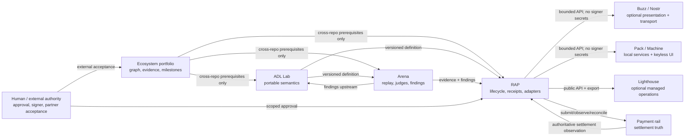
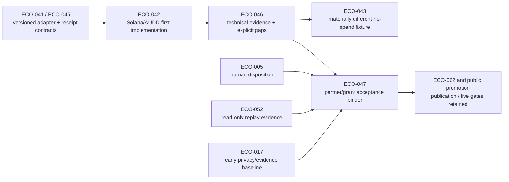

# Portfolio plan, ownership, and delivery gates

**Audience:** contributors, maintainers, reviewers, operators, and programme stakeholders.  
**Goal:** explain where truth lives, how work is ordered, and why technical evidence does not imply external acceptance.  
**Source of truth:** [`planning/graph.yaml`](../planning/graph.yaml) owns cross-repository dependencies; component repositories own their semantics and implementation.  
**Freshness trigger:** review this page after a graph ownership or edge change, a repository is created/retired, a milestone is re-estimated, or a governing obligation changes.

This page is an explanation, not a second roadmap. Dates in
[`planning/milestones.yaml`](../planning/milestones.yaml) are historical planning
provenance and remain unconfirmed; elapsed dates are overdue until a maintainer records
an evidence-backed re-estimate.

## Glossary

| Term | Meaning and canonical owner |
|---|---|
| **ADL** | Agent Definition Language: portable agent definitions and conformance semantics, owned by [`nissan/reddiagent-lab`](https://github.com/nissan/reddiagent-lab). |
| **RAP** | Reddi Agent Protocol: work lifecycle, events, receipts, evidence and payment adapters, owned by [`nissan/reddi-agent-protocol`](https://github.com/nissan/reddi-agent-protocol). RAP observes and coordinates; a payment rail settles value. |
| **Arena** | Deterministic tasks, replay, judging and implementation pressure, owned by [`nissan/reddi-arena`](https://github.com/nissan/reddi-arena). Arena may file findings but does not redefine ADL or RAP. |
| **Buzz projection** | An optional Nostr workspace projection. [`block/buzz`](https://github.com/block/buzz) is upstream; lab issues [419](https://github.com/nissan/reddiagent-lab/issues/419)–[433](https://github.com/nissan/reddiagent-lab/issues/433) contain approved historical design that E06 must classify and reuse. |
| **Reddi Pack** | Proposed keyless Quattro cockpit and separately packaged local services. QML is presentation, never signer custody. |
| **Reddi Machine** | Proposed reproducible developer/node environment, after Pack install, rollback and recovery evidence. |
| **Lighthouse** | Optional managed operations that must preserve local/self-hosted protocol parity and data exit. |
| **Technical evidence** | Reproducible implementation, fixtures, tests, replay, provenance and explicit gaps. It can be complete without satisfying a partner, grant, legal or live-value criterion. |
| **External acceptance** | A decision by a named human, partner, grantor, legal, privacy, operator or publication authority. Code and issue state cannot manufacture it. |
| **Human gate** | A non-automatable approval for a consequential action. A blocked gate is not waived by schedule pressure. |

## Ownership and trust boundaries

The arrows identify authority and data flow, not automatic completion. Nostr events,
UI state, hosted observations, issue closure, and grant dashboards are never settlement
truth. Signer authority stays outside prompts, Buzz, Quattro and generated evidence.

## Dependency semantics

The graph deliberately reuses its existing fields:

- **HT — hard technical:** a `dependsOn` edge for a contract, implementation or test prerequisite.
- **EV — evidence:** a `dependsOn` edge when the evidence must exist before completion; acceptance text names the evidence and its limits.
- **EX — external source/work:** `externalIssue` links canonical component work; governing or partner sources remain explicit in acceptance text.
- **AP — approval:** `humanGates`; agents may prepare but never satisfy these gates.
- **RS — recommended sequence:** milestone or prose ordering only. RS is never encoded as a hard `dependsOn` edge.

This avoids turning chronology or preference into a technical dependency. Every graph
edge should be read with the node acceptance criteria and human gates.

## Technical evidence versus external acceptance

ECO-046 can complete only bounded technical work: declared fixture/localnet or separately
approved devnet tests, reproducible packet structures, and owned gaps. RAP evidence-packet
issues [632](https://github.com/nissan/reddi-agent-protocol/issues/632)–[635](https://github.com/nissan/reddi-agent-protocol/issues/635)
remain unresolved obligations, not satisfied claims. ECO-047 separately owns eligibility,
partner/grant acceptance, live evidence, communication and publication approvals. The
no-spend comparison fixture may follow technical evidence, while the public Buzz sidecar
still requires ECO-047. No blanket dependency waiver is created.

The RAP v0.1 no-new-SPL-program decision versus proposed SPL mint, token-account and
account-layout work remains unresolved. ECO-040 requires a bounded canonical RAP ADR or
semantic disposition; this portfolio document does not choose the answer.

## Early baselines and late readiness

M1 now owns three prerequisites before consuming product milestones:

1. **ECO-016:** trust boundaries, minimum authority controls and incident ownership;
2. **ECO-017:** data, consent, retention, deletion, redaction and public-claim provenance;
3. **ECO-018:** dependencies, SBOM, provenance, build, signing, update and rollback requirements.

These are planned baselines, not completed controls. M8 nodes ECO-110–ECO-115 still own
deep cross-product enforcement, exercises, independent reviews and production/economic
readiness decisions. Moving requirements earlier does not declare the system secure,
private, audited or production-ready.

## Documentation as delivery evidence

Documentation follows the canonical owner rather than forming a competing semantic lane.
Each milestone requires affected documentation to state:

- audience and learning/task goal;
- canonical source and scope;
- prerequisites and runnable examples where applicable;
- acceptance evidence and limitations;
- owner and freshness trigger.

ECO-019 owns the portfolio glossary, ownership map and gap register. RAP
[issue 679](https://github.com/nissan/reddi-agent-protocol/issues/679) owns the
receipt/authority/refusal/replay reader guide. Lab [issue 206](https://github.com/nissan/reddiagent-lab/issues/206)
remains the existing ADL documentation hub, while Buzz documentation stays with mapped
issues 419–433 rather than a duplicate ecosystem semantic source. Component operator and
runbook documentation stays in each canonical repository. Proposed or unfrozen semantics
must be labelled proposed rather than documented as implemented.

## Issue applicability

The independent issue evaluation found useful work and stale projections, not evidence
that stale epics are automatically severe or should be closed. The approved response is:

- preserve issue history and manually authored collaboration state;
- use `milestone:M0` through `milestone:M8` labels for cross-repository visibility;
- publish only owner-bound gaps and link existing component issues rather than duplicating M2+ graph nodes;
- keep close/reopen candidates proposal-only until a maintainer decides;
- never infer source-code correctness from an issue-body review.

### Proposal-only close or rescope candidates

The following table is a maintainer decision aid, not authorization to change issue state.
A stale epic is not automatically a High defect, and closure still requires canonical
owner read-back of delivered scope and residual work.

| Repository | Proposal-only candidates | Why revisit |
|---|---|---|
| RAP | [#335](https://github.com/nissan/reddi-agent-protocol/issues/335), [#349](https://github.com/nissan/reddi-agent-protocol/issues/349), [#350](https://github.com/nissan/reddi-agent-protocol/issues/350), [#468](https://github.com/nissan/reddi-agent-protocol/issues/468), [#471](https://github.com/nissan/reddi-agent-protocol/issues/471), [#500](https://github.com/nissan/reddi-agent-protocol/issues/500), [#513](https://github.com/nissan/reddi-agent-protocol/issues/513), [#541](https://github.com/nissan/reddi-agent-protocol/issues/541) | Their own issue comments report completed children, close-candidate evidence, or a remaining decision record; applicability to current RAP Assurance still needs an owner decision. |
| ADL Lab | [#220](https://github.com/nissan/reddiagent-lab/issues/220), [#420](https://github.com/nissan/reddiagent-lab/issues/420) | The packet cadence was retired; Buzz G1 must be qualified because #426/#427 closed plan/spec deliverables rather than their full implementation acceptance. |
| Arena | [#78](https://github.com/nissan/reddi-arena/issues/78), [#80](https://github.com/nissan/reddi-arena/issues/80), [#81](https://github.com/nissan/reddi-arena/issues/81), [#82](https://github.com/nissan/reddi-arena/issues/82), [#89](https://github.com/nissan/reddi-arena/issues/89), [#92](https://github.com/nissan/reddi-arena/issues/92) | Each generated epic appeared to have all listed children closed at the frozen snapshot; the Arena graph and owner must confirm before any closure. |

No issue in this table was closed, reopened, or relabelled as complete by this increment.

See [`ROADMAP-BDD-APPLICABILITY.md`](ROADMAP-BDD-APPLICABILITY.md) for scenario status and
[`../planning/SYNC-LOG.md`](../planning/SYNC-LOG.md) for implemented-versus-proposed changes.
