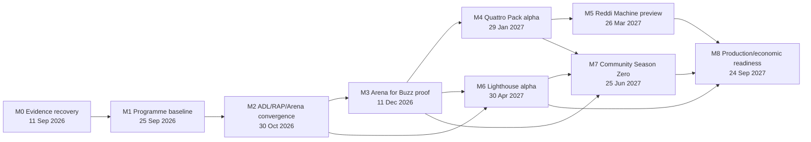

# End-to-end programme roadmap

Planning baseline: 2026-08-26. Dates are planning targets, not grantor-approved deadline
changes or public delivery promises. The canonical milestone gates are in
`planning/milestones.yaml`; the canonical executable backlog is `planning/graph.yaml`.

## Critical path

M0 is the only urgent commitment path. Product proofs continue only where they do not
consume the evidence owners or require live value. Mainnet, signing/custody, public grant
claims, outreach, and spend remain separate human gates.

## Current M0 evidence posture — 2026-08-31

ECO-001 now has a reproducible public GitHub snapshot at
[`evidence/github/ECO-001-2026-08-31.md`](../evidence/github/ECO-001-2026-08-31.md).
That snapshot records default-branch commits, GitHub releases/tags, recent CI,
branch-protection responses, milestones, open PRs, issue counts/status, deployment
API observations, explicit package-evidence gaps, and a 2026-09-01 corrective
primary-source log for release-body, RAP root-package, npm `web`, Omarchy, and x402
provenance details. It proves only those repository/API facts.

M0 can next proceed with:

- ECO-000 source recovery, keeping private grant materials out of this public repository;
- ECO-002 quantitative measures once canonical package names, download windows,
  integration definitions, user/workshop definitions, and privacy-safe exports exist;
- ECO-003 Solana/Quasar identity reconciliation using RAP config and read-only chain evidence;
- ECO-004 commitment-row audit using ECO-000 sources plus ECO-001/ECO-002/ECO-003 evidence.

M0 remains blocked from claiming grant completion, adoption, package publication, live
integration, mainnet readiness, production readiness, or eligible volume until those facts
are proven by the relevant primary sources and approved human gates.

## Milestones and proof outcomes

| Gate | Target | Programme proof | Principal epics |
|---|---:|---|---|
| M0 Evidence Recovery and Grant Truth | 11 Sep 2026 | Every May–July commitment, August target, and AUDD gate has governing text, evidence, gap, owner role, and approved disposition | E00 |
| M1 Programme Baseline and Governance | 25 Sep 2026 | Public control-plane repo, validated graph/projections, research/prompt governance, claim/status views, open-source and community covenants | E01–E02 |
| M2 ADL/RAP/Arena Contract Convergence | 30 Oct 2026 | Portable ADL projection and Agent BOM, rail-neutral RAP lifecycle/events/receipts, multi-runtime conformance, deterministic Arena replay | E03–E05 |
| M3 Reddi Arena for Buzz Proof | 11 Dec 2026 | Upstream-compatible sidecar proves no-spend discovery-through-receipt flow with Nostr privacy/trust and usable lifecycle UX | E06 |
| M4 Reddi Pack for Omarchy Quattro Alpha | 29 Jan 2027 | Signed services and thin keyless QML cockpit install, update, roll back, disable, and uninstall on supported Omarchy | E07 |
| M5 Reddi Machine Developer Preview | 26 Mar 2027 | Evidence chooses provisioning/image shape; reproducible first boot, identity/wallet boundary, hardware matrix, updates and recovery work | E08 |
| M6 Lighthouse Hosted Services Alpha | 30 Apr 2027 | Managed relay/Arena/evidence operations meet isolation/SLO/export/OSS-parity gates and have measured unit economics | E09 |
| M7 Community Season Zero and Builder Beta | 25 Jun 2027 | Safe contributor journeys, reciprocal upstream work, recurring build programme, independent contributors and conformance implementations | E10 |
| M8 Production and Economic Readiness | 24 Sep 2027 | Independent review, incident/refund/recovery drills, privacy/supply-chain evidence, support matrix, and explicit production decisions | E11 |

## First 30 days: recover and make the programme legible

### Days 1–5

- ECO-000: recover governing grant/target documents and amendments;
- ECO-001: freeze dated repository, release, package, deployment, and issue evidence;
- ECO-010: create the empty public GitHub repository and publish the validated bootstrap;
- ECO-011/ECO-020: finish CI integrity and research-source review.

### Days 6–12

- ECO-002: calculate npm, integration, workshop, user, and volume measures from authoritative sources;
- ECO-003: reconcile Quasar, legacy Anchor, environment, and program-ID claims;
- ECO-004: audit May–July, August, and AUDD commitments without duplicating RAP 615–630;
- ECO-021: ratify prompt/eval/trace governance.

### Days 13–30

- ECO-005: obtain human dispositions and any grantor communication approval;
- ECO-012–ECO-015: publish issue projections, decisions/claims, status, and review rhythm;
- ECO-022: baseline the prompt roles on real recovery/planning tasks;
- ECO-030/ECO-040/ECO-050: begin the three canonical M2 audits in parallel after M0 evidence ownership is secure.

## Days 31–90: freeze portable seams, then prove Buzz

Three branches proceed with explicit join gates:

1. **ADL branch:** portability gap -> Agent BOM/dependency graph -> projections ->
   prompt/eval/authority profiles -> multi-runtime conformance.
2. **RAP branch:** leakage audit -> payment adapter -> Solana/AUDD/x402 plus second rail ->
   event/replay contract -> evidence/judgment/settlement receipt binding.
3. **Arena branch:** canonical ADL -> evaluation bundle -> replay/audit -> adversarial tracks ->
   provider/runtime matrix -> upstream findings loop.

Only after those branches join does the Buzz branch build the public sidecar and lifecycle
UX. This prevents Buzz/Nostr event shapes, Solana identifiers, or a single model provider
from becoming accidental ADL/RAP semantics.

## 2027 productization sequence

- Productize the proven services before the Quattro UI; the unsandboxed plugin remains thin.
- Prove install/update/rollback/uninstall before deciding on a custom machine image.
- Build Lighthouse against the same public APIs and conformance fixtures as local/self-hosted.
- Run community programmes only when review, moderation, documentation, and safe no-spend
  paths can support new participants.
- Make production/mainnet decisions last, per product/rail/asset/environment, with explicit
  rollback and claim wording.

## Programme success measures

Delivery is measured by accepted evidence, not issue count. Portfolio measures include:

- commitment evidence coverage and overdue-decision age;
- graph lead time, blocked time, review latency, replay success, and escaped regressions;
- ADL/RAP conformance across independent runtimes and rails;
- independent contributors/implementations and upstream patch acceptance/age;
- clean-machine first success, install/update/recovery success, and support burden;
- Lighthouse availability, evidence durability, export success, support load, margin, and
  open-source parity;
- independently reconciled users, integrations, payments, and grant criteria under their
  exact definitions.

No metric authorizes activity undertaken solely to inflate it.

